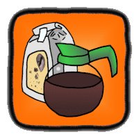

# Koarse Grind Test Framework for Kotlin

***Java Version [here](https://github.com/william-hood/koarse-grind-java).***

This release uses the updated "Boolog" logging system defaulting to the new "light" theme. Koarse Grind has been
transitioned to a stand-alone project using Maven for both build and dependency management. Example
programs may be found in the `src/test` folder.

### To use Koarse Grind as a test framework, add the dependency to your Kotlin project's `pom.xml` file as specified in the Maven Central Repository...
https://central.sonatype.com/artifact/io.github.william-hood/koarse-grind-kotlin

See the example code in the `src/test` folder for a main file and test setup.

***The [Descriptions](https://github.com/william-hood/descriptions-kotlin) project is recommended for use with Koarse Grind.***

---
**WINDOWS USERS MAY NEED TO FOLLOW THESE STEPS TO PROPERLY DISPLAY EMOJIS IN THE CONSOLE**

https://akr.am/blog/posts/using-utf-8-in-the-windows-terminal

---

**Release 3.1**

Over the course of my career, numerous employers have asked me to create a test automation
framework from scratch. After writing several similar frameworks for various
clients, usually based on JUnit or NUnit, I decided to create a "reference implementation" ready for use as-is,
and ready to port to a client's tech-stack of choice if they preferred. The original "Coarse Grind"
was written in Java, but later ported to C#. The current Kotlin version is primarily
based on the C# version, and makes use of Boolog as its integrated log system.
Here's what sets it apart from other test frameworks:
- Not for Unit Tests – As the name suggests it’s intended for larger-grained tests one might do against a program or service that’s already installed and configured; though it can certainly do unit tests if that’s what you want.
- Rich Logging – Automated tests are often run in the middle of the night. If something fails, not only does the logging need to be verbose it has to be easy to read. Originally I used ascii-art in the logs to make failures stand out. Koarse Grind now uses a Direct-to-HTML logging system which I’ve broken out into a separate project called “Boolog.” It visualizes common object types, HTTP Transactions, Exceptions, and embedded log segments with a click-to-expand interface.
- No Annotations – I deliberately chose to NOT implement any form of “*Unit” where tests, setup, and cleanup are annotated functions. Standard aspects of object orientated programming are suitable for that purpose.
- Test Results are NOT Exceptions – I didn’t want Koarse Grind to be like JUnit/NUnit where every failure is a thrown exception and unless you trap them the test is over; --which leads to the next point…
- Multiple Points of Failure – Employers always asked to not end the test if one criterion failed, which meant try/catch blocks everywhere since failures were exceptions. Koarse Grind does not end the test early unless the programmer explicitly tells it to.
- No Separate Runner Program – JUnit and NUnit both compile the tests to libraries requiring a separate runner program. This can be convenient for running in the IDE itself, or with a third party GUI, but it often proved difficult running from the command line. Koarse Grind tests compile as a runnable program, so running them from a script is already solved.
- Artifacts Folder – Every test has a folder for its own artifacts. This will contain at least the section of the log unique to that test. It can also hold screen shots, serialized data files, or other artifact files the test produces.
- Rich Test-Object Description – A special “Descriptions” module lets you describe how a candidate object might look and provides for ways to test the typical border conditions and edge cases.
- When used as shown in the examples, run the main program and the top-level `TestProgram` object will identify your tests, instantiate one of each, and run them. Unless you’re generating a set of tests programmatically (a special TestFactory class provides for this) normal tests do not need to be instantiated or put into a container structure.
- Also, tests now have one-and-only-one category which is directly reflected by the folder hierarchy and the organization of the logs.

## Known Issues
- The HTML-based output logs will appear in a folder titled "Test Results" off of your Documents directory. The root output folder can be changed from $/Documents/TestResults to the directory of your choice by setting `defaultParentFolder` before calling `TestProgram.run()`.
- Known Koarse Grind Issue: If a module, or its directory, has a space in its name any tests it contains will not be found and will not run. Don't put spaces in module names. Use an underscore instead.

## Released under the terms of the MIT License
© 2020, 2021, 2022, 2023, 2025 William Hood

*Permission is hereby granted, free of charge, to any person obtaining a copy
of this software and associated documentation files (the "Software"), to deal
in the Software without restriction, including without limitation the rights to
use, copy, modify, merge, publish, distribute, sublicense, and/or sell copies
of the Software, and to permit persons to whom the Software is furnished
to do so, subject to the following conditions:*

*The above copyright notice and this permission notice shall be included
in all copies or substantial portions of the Software.*

*THE SOFTWARE IS PROVIDED "AS IS", WITHOUT WARRANTY OF ANY KIND,
EXPRESS OR IMPLIED, INCLUDING BUT NOT LIMITED TO THE WARRANTIES
OF MERCHANTABILITY, FITNESS FOR A PARTICULAR PURPOSE AND
NONINFRINGEMENT. IN NO EVENT SHALL THE AUTHORS OR COPYRIGHT
HOLDERS BE LIABLE FOR ANY CLAIM, DAMAGES OR OTHER LIABILITY,
WHETHER IN AN ACTION OF CONTRACT, TORT OR OTHERWISE, ARISING
FROM, OUT OF OR IN CONNECTION WITH THE SOFTWARE OR THE USE OR
OTHER DEALINGS IN THE SOFTWARE.*

## Contact Information
https://www.linkedin.com/in/william-a-hood-pdx/

william.arthur.hood@gmail.com
